Using Visual Studio Code for Raspberry Pi Development
========================================================

VSCode is one of the most popular code editors available today. This guide will help you set up VSCode
for developing applications for Raspberry Pi. First, we will setup the IDE for remote development on the 
Raspberry Pi, and then we will configure it for cross-compiling applications for our custom embedded Linux
system built with Buildroot.

Installing VSCode in Ubuntu
----------------------------
First, we need to install VSCode on the host machine, that in our case is an Ubuntu virtual machine.
You can get the latest version of VSCode from the `official website <https://code.visualstudio.com/download>`_.
Select the **.deb package** (see :numref:`vscodedownload`) for Debian-based distributions and once it is downloaded 
open a terminal in the download folder and run the following command:

.. code-block:: bash

    sudo apt install ./code_*.deb

Select **Yes** when prompted to add the Microsoft repository

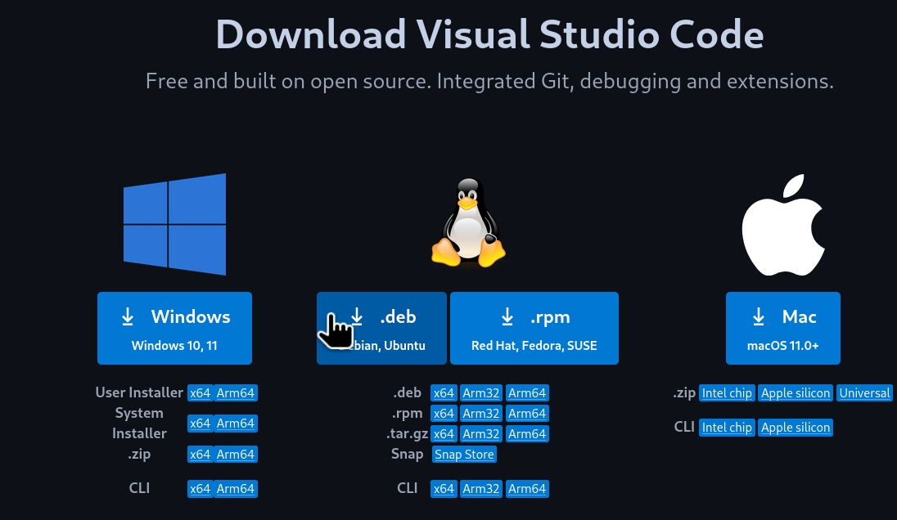

   VSCode .deb download

.. note::
    You can also install VSCode using the snap package manager with the following command:

    .. code-block:: bash

          sudo snap install --classic code

After the installation is completed, open a terminal and launch VSCode to check that it has been installed correctly:

.. code-block:: bash

    code

A window should pop up with the VSCode interface (see :numref:`vscode`).

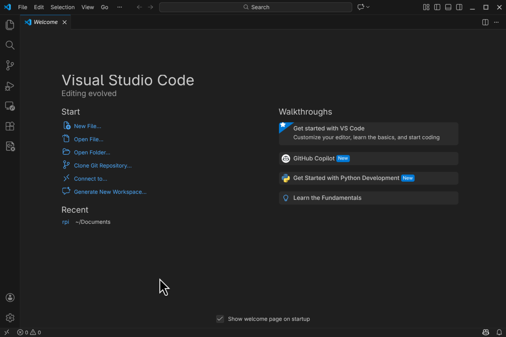

   VSCode interface

Setting up VSCode for Remote Development
--------------------------------------
Now we are going to set up VSCode for remote development on the Raspberry Pi. In this case we will be able to
edit, compile and debug applications on the Raspberry Pi from the VSCode running on our host machine (Ubuntu Virtual Machine).
In this use case, **we will not be cross-compiling applications**, but compiling then natively on the Raspberry Pi. This is possible
because the Raspberry Pi OS that we installed on the Pi includes all the necessary development tools.

Installing the Remote - SSH Extension
^^^^^^^^^^^^^^^^^^^^^^^^^^^^^^^^^
To enable remote development using VSCode, we need to install the `Remote - SSH` extension. To do this, open VSCode and on 
the left bar, click on the *Extensions* icon. Type "*remote ssh*" in the search bar and install the extension named *Remote - SSH* 
by Microsoft (see :numref:`vscoderemotessh`).

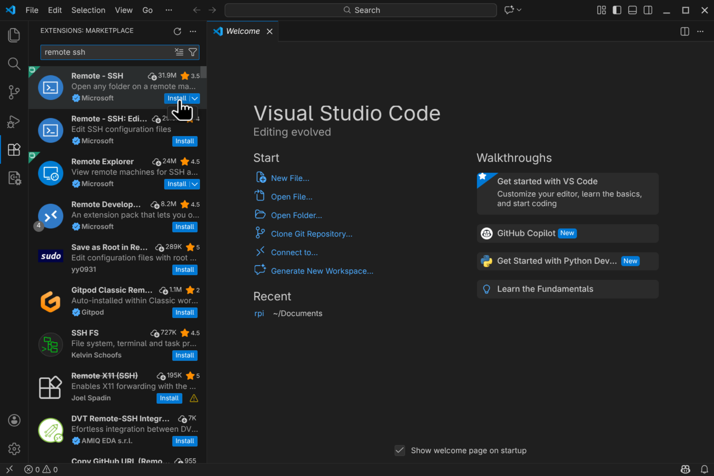

   Remote - SSH extension installation

This extension allows us to open remote folders and files on any remote machine with SSH access and work with them 
just as if they were on our local machine.

Adding the Raspberry Pi as a Remote Host
^^^^^^^^^^^^^^^^^^^^^^^^^^^^^^^^^^^^^^
Now we need to add our Raspberry Pi as a remote host in VSCode. To do this, select click on the bottom left corner icon
(see :numref:`vscoderemote`) and on the upper menu select *Connect to Host...*.

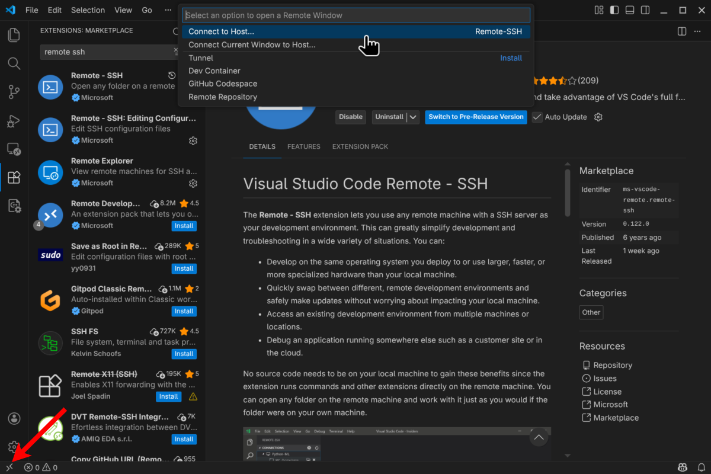

   Connect to Host option

Next, select *Add New SSH Host...* and add the SSH connection command to connect to the Raspberry Pi.

.. code-block:: bash

    ssh <username>@<raspberry_pi_ip_address>

Replace ``<username>`` with the username (**rpi-student**) you use to log in to the Raspberry Pi and 
``<raspberry_pi_ip_address>`` with the IP address of your Raspberry Pi.
After adding the SSH command, you will be prompted to select the SSH configuration file to update. Select the default option
(*~/.ssh/config*). This will add the Raspberry Pi connection details to the SSH configuration file.

Connecting to the Raspberry Pi
^^^^^^^^^^^^^^^^^^^^^^^^^^^^^^

Now, to connect to the Raspberry Pi, click again on the bottom left corner icon and select *Connect to Host...*. This time
select the connection that you just added (it should be named with your Raspberry Pi IP address). This will open a new 
VSCode window and you will be connected to the Raspberry Pi as shown in the bottom left (see :numref:`vscoderemoteconnected`).

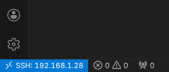

   VSCode connected to Raspberry Pi

Now you can open folders and files that are on the Raspberry Pi and edit them directly from VSCode running on your host machine.
Take your time and explore the different features of VSCode for remote development, e.g. **the integrated terminal** that 
allows you to run commands directly on the Raspberry Pi or the Git integration.

.. note::
    
    It is now a good idea to install VSCode extensions that can help during development, e.g. C/C++ and Python extensions. 

(Optional) Setting up SSH Key-based Authentication
^^^^^^^^^^^^^^^^^^^^^^^^^^^^^^^^^^^^^^^^^^^^^^^^^^^^
With the configuration above, every time you connect to the Pi using VSCode, you will be prompted to enter the password
for the **rpi-student** user. To avoid this, you can set up SSH key-based authentication. To do this, first we 
need to generate an SSH key pair (public and private) **on the host machine (Ubuntu VM)**. Open a terminal in the 
Ubuntu VM and run the following command:

.. code-block:: bash

    ssh-keygen -t rsa -b 4096

Press Enter to accept the default values. After this a key pair will be generated in the *~/.ssh/* folder.
Take a look at the generated files, and **copy the content of the public key** file (*id_rsa.pub*).

Now, we need to add the public key to the Raspberry Pi to allow key-based authentication. **Connect to the Raspberry Pi**
using VSCode or a terminal and open (or create) the *~/.ssh/authorized_keys* file. Then paste the content of the public
key file at the end of the *authorized_keys* file and save it.

Now you should be able to connect to the Raspberry Pi using VSCode without being prompted for a password.

.. note::

    If you have issues connecting to the Raspberry Pi, or keeps asking for a password, try adding the key to the SSH agent (on the Ubuntu VM):
    
    .. code-block:: bash

        eval "$(ssh-agent -s)"
        ssh-add ~/.ssh/id_rsa

Compiling C/C++ Applications on the Raspberry Pi
^^^^^^^^^^^^^^^^^^^^^^^^^^^^^^^^^^^^^^^^^^^^^^^^^^^^^^^^^^^^^^
Now that we have set up VSCode for remote development on the Raspberry Pi, we can compile and debug C/C++ applications
directly on the Pi.

.. important::

    Make sure that VSCode is connected to the Raspberry Pi as explained in the previous section.

First, lets create a new folder on the Raspberry Pi to create an example C application, we will be using the Makefile-based 
build system. 
Open the integrated terminal in VSCode (View -> Terminal) and run the following commands:

.. code-block:: bash

    mkdir hello-world

Now, in VSCode, open the *hello-world* folder that we just created on the Raspberry Pi (File -> Open Folder...).
The folder is currently empty, create a new file named *main.c* and add the following code:

.. code-block:: c

    #include <stdio.h>

    int main(void) {
        printf("Hello world from Raspberry Pi\n");
        return 0;
    }

Next, create a new file named *Makefile* in the same folder and add the following content:

    .. code-block:: make

        TARGET = main
        SRCS = main.c
        OBJS = $(SRCS:.c=.o)

        INCLUDE = 
        LIBS = -lm -lpthread

        CC ?= gcc
        CFLAGS += -Wall -g $(INCLUDE)
        LDFLAGS += $(LIBS)

        all: $(TARGET)

        $(TARGET): $(OBJS)
            @echo "[link] $^"
            $(CC) -o $@ $^ $(LDFLAGS)

        %.o: %.c
            @echo "[compile] $<"
            $(CC) $(CFLAGS) -c $< -o $@

        .PHONY: clean
        clean:
            rm -f $(TARGET) $(OBJS)

.. note::

    Check the flags used in the Makefile and note that the debug flag (-g) is enabled to allow debugging the application later.

.. note::

    You can use this Makefile as a template for your future C applications.

Your file explorer should look like shown in figure :numref:`vscodehellofolder`.

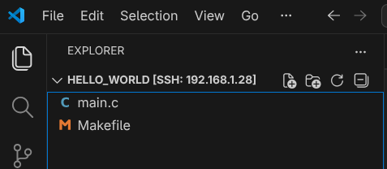

   Hello World project folder structure

Now, to compile the application, open the integrated terminal in VSCode and run the following command:

.. code-block:: bash

    make

And run the application with:

.. code-block:: bash

    ./main

You should see something like shown in figure :numref:`vscodehello`.

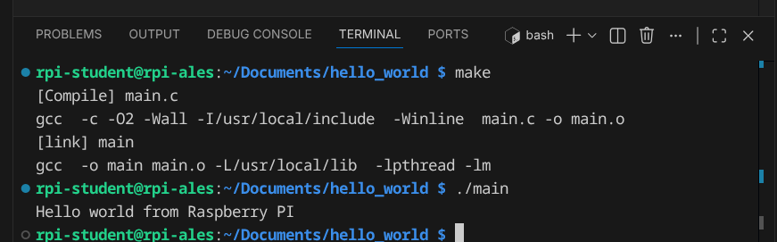

   Hello World application running on Raspberry Pi

In VSCode we can automate this process by creating tasks for building and running the application. In the file explorer,
create a new folder named *.vscode* inside the *hello-world* folder. Then, inside the *.vscode* folder, create a new file
named *tasks.json* and add the following content:

.. code-block:: json

    {
        "version": "2.0.0",
        "tasks": [
            {
                "label": "build",
                "type": "shell",
                "command": "make"
            },
            {
                "label": "build and run",
                "type": "shell",
                "command": "make && ./main"
            },
            {
                "label": "clean",
                "type": "shell",
                "command": "make clean"
            }
        ]
    }

Your file explorer should look like shown in figure :numref:`vscodetasks`.

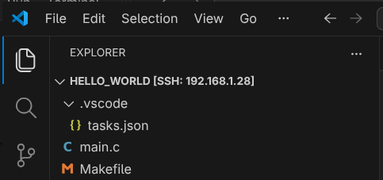

   VSCode tasks configuration

Now, you can use the "*build*" and "*build and run*" tasks to compile and run the application. To do this, in VSCode
select *Terminal -> Run Task...* and select the desired task.

Debugging C/C++ Applications on the Raspberry Pi
^^^^^^^^^^^^^^^^^^^^^^^^^^^^^^^^^^^^^^^^^^^^^^^^^^^^^^^^^^^^^^
VSCode also allows us to debug C/C++ applications running on the Raspberry Pi. To do this, we need to create a debug configuration.
In the file explorer, inside the *.vscode* folder, create a new file named *launch.json* and add the following content:

.. code-block:: json

    {
        "version": "0.2.0",
        "configurations": [
            {
                "name": "Debug Raspberry Pi",
                "type": "cppdbg",
                "request": "launch",
                "program": "${workspaceFolder}/main",
                "args": [],
                "stopAtEntry": false,
                "cwd": "${workspaceFolder}",
                "environment": [],
                "externalConsole": false,
                "MIMode": "gdb",
                "setupCommands": [
                    {
                        "description": "Enable pretty-printing for gdb",
                        "text": "-enable-pretty-printing",
                        "ignoreFailures": true
                    }
                ],
                "preLaunchTask": "build",
                "miDebuggerPath": "/usr/bin/gdb"
            }
        ]
    }

.. note::

    Take your time to investigate the different options available in the debug configuration file so you can 
    customize it to your projects.

Your file explorer should now look like shown in figure :numref:`vscodelaunch`.

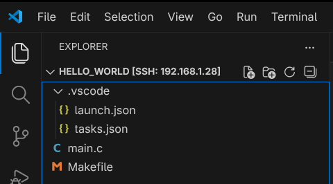

   VSCode debug configuration

Now, to start debugging the application, set a breakpoint in the *main.c* file by clicking on the left margin
next to the line number. Then, in VSCode select *Run -> Start Debugging* (or press F5). The debug window will
open and the application will stop at the breakpoint (see :numref:`vscodedebug`).

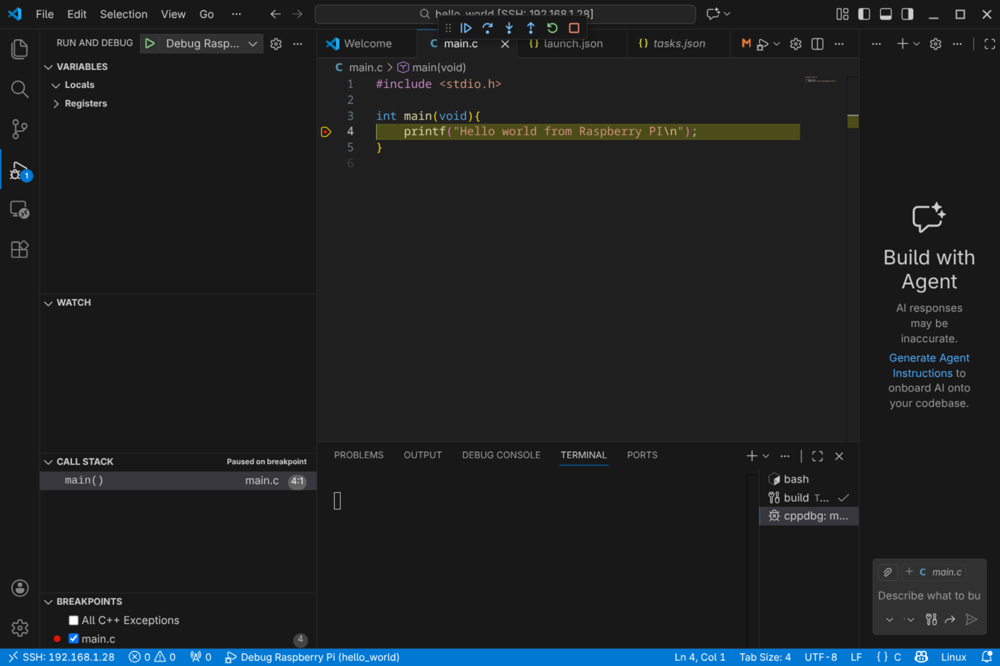

   VSCode debugging session

Notice the debug toolbar that allows you to control the debugging session (continue, step over, step into, etc.)
and the different debug panels (variables, watch, call stack, breakpoints, etc.) available.

Setting up VSCode for Cross-Compiling Applications
----------------------------------------------
We have seen how to set up VSCode for remote development, compiling and debugging applications natively on the Raspberry Pi.
In this section we will see how to set up VSCode for cross-compiling applications for our custom embedded Linux system built with Buildroot.

.. important::

    This section assumes that you have already generated the custom embedded Linux image as well as the cross-compile toolchain.

In this case we will be running VSCode on the host machine (Ubuntu VM) and we will use the buildroot-generated cross-compile 
toolchain to compile applications for the Raspberry Pi. We will copy the compilated applications to the Raspberry Pi 
and run them there.

.. important:: 

    Make sure that you have installed the **C/C++ extension by Microsoft** in VSCode.

Configuring the VSCode project for Cross-Compilation
^^^^^^^^^^^^^^^^^^^^^^^^^^^^^^^^^^^^^^^^^^^^^^^^^^^^^^^^^^^^^^
Start by creating a new folder for your project **on the host machine** and open it with VSCode (File -> Open Folder...).

Now, add the source files for your application to the project folder. For example, create a file named **main.c** with the basic *Hello World* shown in the previous section.
Also, create a **Makefile** for your project. You can use the same Makefile shown in the previous section.

VSCode does not have built-in support for cross-compilation, but we can configure it to use the Buildroot-generated toolchain.
To do so, create a folder named *.vscode* inside your project folder. Here is where we will add the configuration files for building and debugging our application.

Create inside the *.vscode* folder a file named *settings.json*. Add the following content to the file:

.. code-block:: json

    {
        "buildroot_build_dir": "<path_to_buildroot_build_directory>",
        "target_ip": "<rpi_ip_address>",
        "executable_file": "<executable_file_name>",
        "buildroot_env": "${config:buildroot_build_dir}/host/environment-setup",
        "host_gdb": "${config:buildroot_build_dir}/host/bin/aarch64-linux-gdb",
    }

Replace the values of the different fields with the appropriate values for your setup:

- ``<path_to_buildroot_build_directory>``: The path to the Buildroot build directory where the toolchain and sysroot are located, e.g. */home/ubuntu/Documents/rpi/build*.
- ``<rpi_ip_address>``: The IP address of your Raspberry Pi.
- ``<executable_file_name>``: The name of the executable file that you want to compile and run on the Raspberry Pi, e.g. *main*.

Now, lets configure the tasks that tell VSCode how to build and deploy our application. Create a file named *tasks.json* inside the *.vscode* folder and add the following content:

.. code-block:: json

    {
        "version": "2.0.0",
        "tasks": [
            {
                "label": "Build",
                "type": "shell",
                "command": "/bin/bash",
                "args": [
                    "-c",
                    "source ${config:buildroot_env} && make clean all"
                ],
                "group": {
                    "kind": "build",
                    "isDefault": true
                }
            },
            {
                "label": "Deploy",
                "type": "shell",
                "command": "ssh root@${config:target_ip} 'rm -f /root/${config:executable_file}' && scp ${config:executable_file} root@${config:target_ip}:/root/",
                "dependsOn": ["Build"]
            },
            {
                "label": "Start GDBServer",
                "type": "shell",
                "command": "ssh root@${config:target_ip} 'killall -q gdbserver; gdbserver :2345 /root/${config:executable_file}'",
                "isBackground": true,
                "problemMatcher": {
                    "pattern": { "regexp": "." },
                    "background": {
                        "activeOnStart": true,
                        "beginsPattern": "Process /root/.* created",
                        "endsPattern": "Listening on port 2345"
                    }
                },
                "dependsOn": ["Deploy"]
            },
            {
                "label": "Kill GDBServer on Target",
                "type": "shell",
                "command": "ssh root@${input:target_ip} 'killall -q gdbserver || true'",
                "problemMatcher": []
            }
        ]
    }

This configuration defines the following tasks:

- ``Build``: This task builds the application using the Buildroot-generated toolchain. First, it **sources the Buildroot environment setup script to set up the necessary environment variables for cross-compilation**, and then it uses the Makefile to build the application.
- ``Deploy``: This task deploys the compiled application to the Raspberry Pi. It does so by first removing any existing executable with the same name on the Raspberry Pi and then copying the new executable using SCP (using the SSH protocol).
- ``Start GDBServer``: This task starts a GDB server on the Raspberry Pi to allow remote debugging.
- ``Kill GDBServer on Target``: This task kills any running GDB server on the Raspberry Pi.

Now, we need to configure the debug configuration to allow debugging the application running on the Raspberry Pi. Create a file named *launch.json* inside the *.vscode* folder and add the following content:

.. code-block:: json

    {
        "version": "0.2.0",
        "configurations": [
            {
                "name": "Debug on Target",
                "type": "cppdbg",
                "request": "launch",
                "program": "${config:executable_file}",
                "args": [],
                "stopAtEntry": true,
                "cwd": "${workspaceFolder}",
                "environment": [],
                "externalConsole": false,
                "MIMode": "gdb",
                "miDebuggerPath": "${config:host_gdb}",
                "miDebuggerServerAddress": "${config:target_ip}:2345",
                "preLaunchTask": "Start GDBServer",
                "postDebugTask": "Kill GDBServer on Target",
                "setupCommands": [
                    {
                        "description": "Enable pretty-printing for gdb",
                        "text": "-enable-pretty-printing",
                        "ignoreFailures": true
                    }
                ]
            }
        ]
    }

This defines a debug configuration named **Debug on Target** that uses the GDB server running on the Raspberry Pi to debug the application.
Some important fields in this configuration are:

- ``program``: The name of the executable file to debug.
- ``miDebuggerPath``: The path to the GDB executable on the host machine (the Buildroot-generated GDB). Remember that we are debugging from an x86_64 machine an application running on an ARM machine, so we need to use the Buildroot-generated GDB that supports cross-debugging.
- ``miDebuggerServerAddress``: The address of the GDB server running on the Raspberry Pi (IP address and port).
- ``preLaunchTask``: The task to run before starting the debug session (in this case, we start the GDB server, which also builds and deploys the application).

.. note::

    You can customize this debug configuration to fit your needs, e.g. by adding arguments to the application (use the "args" field), setting environment variables ("environment" field), etc.

This is enough configuration to allow us to build, deploy and debug our application. However, you may have noticed that
VSCode reports errors in the source code because it cannot find the header files and libraries for our target system.
To fix this, and get proper code completion and error checking, we need to configure the C/C++ extension to use the Buildroot sysroot.
To do this, create a file named *c_cpp_properties.json* inside the *.vscode* folder and add the following content:

.. code-block:: json

    {
        "configurations": [
            {
                "name": "Buildroot-RPI",
                "includePath": [
                    "${workspaceFolder}/**",
                    "${config:buildroot_build_dir}/host/aarch64-buildroot-linux-gnu/sysroot/usr/include"
                ],
                "defines": [],
                "compilerPath": "${config:buildroot_build_dir}/host/bin/aarch64-linux-gcc",
                "cStandard": "c11",
                "cppStandard": "c++17",
                "intelliSenseMode": "linux-gcc-arm",
                "compilerArgs": [
                    "--sysroot=${config:buildroot_build_dir}/host/arm-buildroot-linux-gnueabihf/sysroot"
                ],
                "browse": {
                    "path": [
                        "${workspaceFolder}",
                        "${config:buildroot_build_dir}/host/aarch64-buildroot-linux-gnu/sysroot/usr/include"
                    ],
                    "limitSymbolsToIncludedHeaders": true
                }
            }
        ],
        "version": 4
    }

This tells the C/C++ extension to use the Buildroot sysroot for code completion and error checking. The most important fields are:

- ``includePath``: This field specifies the include paths for header files. We add the Buildroot sysroot include directory to the include path.
- ``compilerPath``: This field specifies the path to the compiler to use for code analysis. We set it to the Buildroot-generated cross-compiler.
- ``compilerArgs``: This field allows us to specify additional arguments to pass to the compiler for code analysis. We use it to specify the sysroot to use for code analysis.

At this point your VSCode project should look like shown in figure :numref:`vscodecrossproject`.

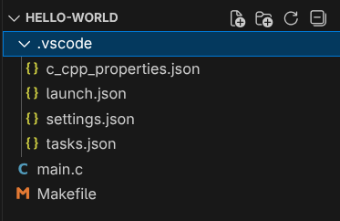

   VSCode project structure for cross-compilation

This is enough to allow you to build, deploy and debug your application for the Raspberry Pi using VSCode. 

Setting up an SSH Key
^^^^^^^^^^^^^^^^^^^^^^^^^^^^^^^^^^^^^^^^^^^^^^^^^^^^^^^^^^^^^^^
This compilation, deployment and debugging process uses SSH to connect to the Raspberry Pi. You might be asked several times to enter the password for the **root** user on the Raspberry Pi. 
It is now **highly recommended** to set up SSH key-based authentication to avoid this. The process is almost the same as explained in the previous section `(Optional) Setting up SSH Key-based Authentication`_ :

1. Generate an SSH key pair on the host machine (Ubuntu VM) if you do not have one yet.
2. Copy the content of the public key file (e.g. *id_rsa.pub*).
3. Connect to the Raspberry Pi and add the public key to the */root/.ssh/authorized_keys* file (create it if it does not exist).

You should now be able to connect to the Raspberry Pi without being constantly prompted for a password.

Cross-Compiling, Deploying and Executing the Application
^^^^^^^^^^^^^^^^^^^^^^^^^^^^^^^^^^^^^^^^^^^^^^^^^^^^^^^^^^^^^^^

Now, use the defined tasks to build and deploy your application to the Raspberry Pi.
To do this, in VSCode select *Terminal -> Run Task...*. On the top you should see a list of the defined tasks as shown in figure :numref:`vscodetasklist`.

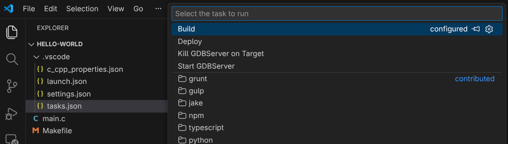

   List of defined tasks in VSCode

Select the *Deploy* task to build and deploy the application to the Raspberry Pi. You should see in the terminal output how the buildroot environment is sourced, the aplication is built, and then copied to the Raspberry Pi using SCP (see :numref:`vscodedeploy`).

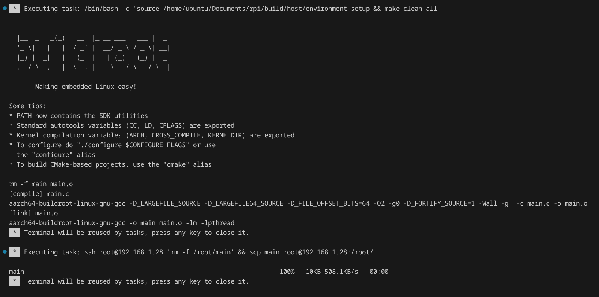

   Build and deploy task output in VSCode terminal

After the deployment is completed, you can connect to the Raspberry Pi using SSH and run the application executable, which can be found in the */root/* directory.

.. note::

    The recommended flow is to use the *Build* task to build the application until you have no compilation errors, and then use the *Deploy* task to deploy the application to the Raspberry Pi.

.. note::

    You can create additional tasks to automate other processes, e.g. a task to run the application on the Raspberry Pi using SSH.

Debugging the Application
^^^^^^^^^^^^^^^^^^^^^^^^^^^^^^^^^^^^^^^^^^^^^^^^^^^^^^^^^^^^^^^
If you want to debug the application, set a breakpoint in the source code (see :numref:`vscodebreakpoint`) and then start the debug session (Run -> Start Debugging or F5).
You will see in the terminal how the application is compiled, deployed and the GDB server is started on the Raspberry Pi. The debug view will open and you will be able to debug the application running on the Raspberry Pi (see :numref:`vscodedebugcross`).
Then, you can use the debug toolbar to control the program execution, inspect variables...

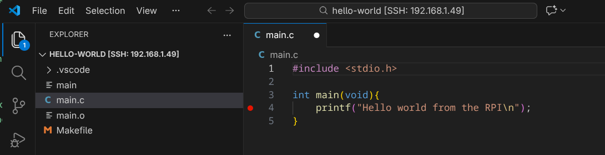

   Setting a breakpoint in VSCode

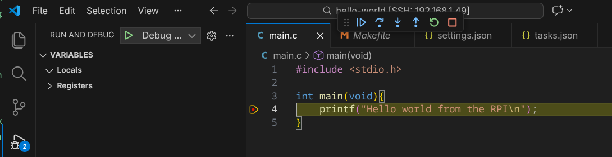

    Debugging an application running on the Raspberry Pi from VSCode

